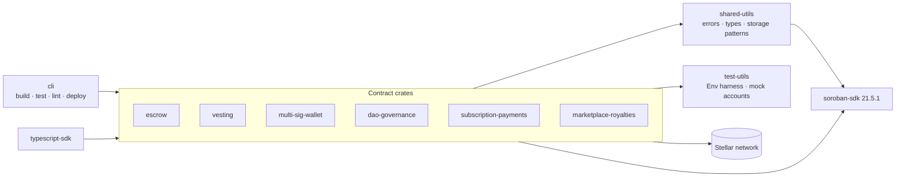
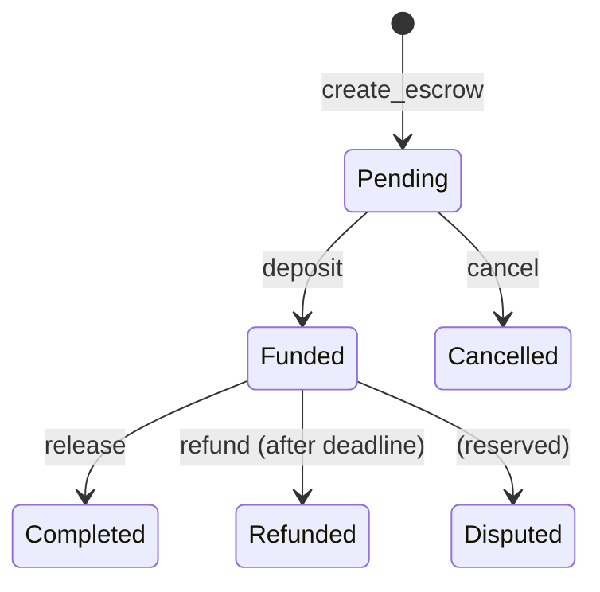

# Soroban Forge

[](LICENSE)
[](https://github.com/Meet-hybrid/soroban-forge/actions)
[](https://www.rust-lang.org)
[](https://github.com/Meet-hybrid/soroban-forge/blob/main/.github/workflows/ci.yml)

**Soroban Forge** is a library of reusable Soroban smart-contract foundations
and developer tooling for the Stellar ecosystem — escrow, vesting, multi-
signature wallets, DAO governance, subscription payments, and marketplace
royalties, plus a developer CLI and TypeScript bindings.

## Proof at a glance

The escrow contract is **deployed and verified on Stellar testnet**. Every
step below was executed live; run `bash scripts/demo-testnet.sh` to reproduce
([step-by-step walkthrough with expected output](docs/WALKTHROUGH.md)).

| Artifact | Value |
|---|---|
| Network | Stellar Testnet (`Test SDF Network ; September 2015`) |
| Escrow contract | `CC227UDF6WBLRTOKKVRIJN7BGSBK67ZGV6IDARJ2AMATGSQ7UZNBZHSB` |
| WASM sha256 | `ccbb6603cce6d194407b822df110c91324939cea92ba21937a6d9f1e2c9e48b9` |
| soroban-sdk | 27.0.6 · stable Rust · `wasm32v1-none` · 18,054 bytes |
| Demo token (SAC) | `CBJQ53EOHB5MWSS7CETN523WILLNVS7NQAQQAQIS5QAYTPRCZSGKL23O` (`credit` asset) |
| Roles | buyer `GCTEIX…VSGF` · seller `GCGPZ3…4SFS` · arbiter `GCR7CB…GJTQ` |

| Round | Flow | Transaction |
|---|---|---|
| 1 | create → deposit → release (seller paid 500) | [create 817950c8…](https://stellar.expert/explorer/testnet/tx/817950c8ad95ecad9636783e5e8e8b8e515f94e3364b63c2c02328ff3b675bb9) · deposit · release |
| 2 | create → deposit → dispute(buyer) → resolve for seller | dispute + resolve transactions |
| 3 | create → deposit → dispute(seller) → resolve for buyer | dispute + resolve transactions |

After all three rounds: **buyer 500 + seller 1000 = 1500 credit minted; the
contract holds zero** — the on-chain conservation property (`deposited ==
paid out`) verified on a live network, matching the in-repo property test.
The token-transfer event from round 1's deposit is visible in the transaction
linked above: 500 `credit` moved buyer → contract.

> Honest notes: testnet only (no mainnet deployment); the demo identities are
> throwaway keys from this machine, not fixtures of the protocol; two-auth
> escrow creation was deliberately **rejected as a design** — a live
> `TxBadAuth` on every standard signing path during this demo motivated the
> buyer-only creation flow. See [docs/KNOWN-LIMITATIONS.md](docs/KNOWN-LIMITATIONS.md).

The goal is simple: stop rewriting the same contracts for every project. Pick a
well-documented foundation, audit it for your use case, and ship.

> **Status:** This project is under active development. The contracts are **not
> independently audited** and should not be treated as production-ready without
> your own security review. The **escrow contract is the flagship**: it holds
> and moves real SEP-41 tokens end-to-end and is verified by a conservation
> property test. The other five contracts are state machines awaiting the same
> treatment — see the [Feature Status Matrix](docs/FEATURE-STATUS.md) and
> [Known Limitations](docs/KNOWN-LIMITATIONS.md) for exactly what is and is
> not done.

## Contracts

| Contract | Description | Status |
|----------|-------------|--------|
| **Escrow** | Three-party escrow holding real SEP-41 tokens: `create → deposit → release / refund / dispute → resolve / cancel`, arbiter-enforced dispute flow, lifecycle events, per-record persistent storage with TTL keeping | ✅ **Flagship** · 27 tests · conservation property verified |
| **Vesting** | Time-locked token release with cliff and linear release (`create_schedule → claim / claimable`) — state machine only, no settlement yet | ✅ State machine · 21 tests |
| **Multi-Sig Wallet** | Multi-owner wallet with configurable approval thresholds (`initialize → submit → confirm → execute`) — no dispatch yet | ✅ State machine · 18 tests |
| **DAO Governance** | On-chain proposals, one-vote-per-voter voting, deadline enforcement, and finalisation — executes nothing on-chain | ✅ State machine · 16 tests |
| **Subscription Payments** | Recurring payment plans with periodic billing (`subscribe → charge / cancel`) — charges nothing | ✅ State machine · 12 tests |
| **Marketplace Royalties** | Asset sales with configurable basis-point royalty distribution — pays no recipients | ✅ State machine · 10 tests |

Implementation work is tracked as scoped, labeled
[issues](https://github.com/Meet-hybrid/soroban-forge/issues).

## Architecture



The workspace is a virtual Cargo workspace: each contract is its own crate so
it can be deployed and upgraded independently, while `shared-utils` and
`test-utils` keep error handling, storage patterns, and test harnesses DRY.

### Escrow lifecycle



## Repository layout

```
soroban-forge/
├── crates/                   # Rust smart contracts and libraries
│   ├── shared-utils/         # ForgeError, storage patterns, shared types
│   ├── test-utils/           # Soroban Env test harness and mock accounts
│   ├── cli/                  # Developer CLI (build / test / lint / deploy)
│   ├── escrow/               # ✅ implemented
│   ├── vesting/              # ✅ implemented
│   ├── multi-sig-wallet/
│   ├── dao-governance/
│   ├── subscription-payments/
│   └── marketplace-royalties/
├── packages/                 # Language bindings and example apps
│   ├── typescript-sdk/       # @soroban-forge/escrow-client (generated from the deployed escrow ABI)
│   ├── nextjs-example/       # Next.js reference application
│   └── deployment-templates/ # Docker and deployment templates
├── docs/                     # Architecture, tutorials, best practices
├── templates/                # Contract scaffolding templates
└── scripts/                  # Maintainer tooling (labels, issue creation)
```

Tests live inside each contract crate as Soroban `Env`-based test modules and
run through `cargo test --workspace`.

## Quick Start

### 1. Prerequisites

The workspace pins **stable Rust** and builds contracts for the
`wasm32v1-none` target required by soroban-sdk 27.x.

```bash
rustup target add wasm32v1-none          # needed to build contracts to WASM
cargo install soroban-cli                # optional: for deployment
```

### 2. Clone and verify

```bash
git clone https://github.com/Meet-hybrid/soroban-forge.git
cd soroban-forge

cargo build --workspace --all-targets --locked   # compile everything
cargo test --workspace --all-targets --locked    # run the contract test suite
make lint                                        # fmt + clippy gates
```

### 3. Build a contract to WASM

```bash
cargo build --release --target wasm32v1-none -p soroban-forge-escrow
# → target/wasm32v1-none/release/soroban_forge_escrow.wasm
```

### 4. Use the developer CLI

```bash
cargo run -p soroban-forge-cli -- --help
cargo run -p soroban-forge-cli -- build --release
cargo run -p soroban-forge-cli -- test --package soroban-forge-escrow
```

### 5. Deploy to testnet

```bash
stellar contract deploy \
  --wasm target/wasm32v1-none/release/soroban_forge_escrow.wasm \
  --source-account <YOUR_KEYPAIR_NAME> \
  --network testnet
```

Then exercise the deployed contract with `stellar contract invoke` — e.g.
`create_escrow(buyer, seller, arbiter, token, amount, timeout)`, then
`deposit` (moves real tokens), `release`, `refund`, `dispute` + `resolve`,
or `cancel` per the lifecycle above.

## Development

```bash
make build         # cargo build --workspace --all-targets
make test          # cargo test --workspace --all-targets
make format        # cargo fmt --all
make lint          # cargo clippy --workspace --all-targets -- -D warnings
make audit         # cargo audit (requires cargo-audit)
make doc           # open rustdoc
```

CI (`.github/workflows/ci.yml`) enforces: **Rustfmt · Clippy (-D warnings) ·
Build · Test · Security Audit · WASM Size Check**, with `--locked` for
reproducible builds and a per-contract WASM size budget.

## Documentation

- [Getting Started](docs/tutorials/getting-started.md)
- [Writing Your First Contract](docs/tutorials/writing-your-first-contract.md)
- [Architecture](docs/architecture/index.md)
- [Contract Overview](docs/contracts/index.md)
- [Feature Status Matrix](docs/FEATURE-STATUS.md)
- [Known Limitations](docs/KNOWN-LIMITATIONS.md)
- [Storage Patterns](docs/architecture/storage-patterns.md)
- [Smart Contract Security](docs/best-practices/smart-contract-security.md)
- [Testing Strategy](docs/best-practices/testing-strategy.md)

## Contributing

We welcome contributions! Please read [CONTRIBUTING.md](CONTRIBUTING.md) for
our code of conduct and contribution process. Contributor-facing work is
scoped as labeled [issues](https://github.com/Meet-hybrid/soroban-forge/issues).

Contributions are **fork-first**: fork the repository, work on a branch in your
fork, and open a pull request against `main`. Each issue lists its acceptance
criteria and verification commands.

## Security

Please read [SECURITY.md](SECURITY.md) for how to report vulnerabilities.

## License

Licensed under either of

- [Apache License, Version 2.0](LICENSE-Apache)
- [MIT license](LICENSE-MIT)

at your option.

## Acknowledgments

Built for the Stellar developer community.

## Deployment

See [docs/deployment-and-storage.md](docs/deployment-and-storage.md).
